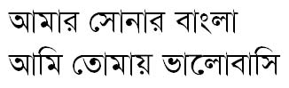
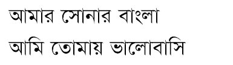

# Bangla Web Fonts

The aim of this project is making the web more beautiful, fast, and open through great Bengali typography with one of the fastest **Global CDN**. Currently, the following fonts are supported (though more fonts are coming soon).

## AdorshoLipi


Font Source: cgimagine

## Embed Font

To use this font into a website, embed this code in the `<head>` of your HTML document.

#### STANDARD

```css
<link href="https://fonts.maateen.me/adorsho-lipi/font.css" rel="stylesheet">
```

#### IMPORT in CSS

```css
<style>
@import url('https://fonts.maateen.me/adorsho-lipi/font.css');
</style>
```

## Specify in CSS

Use the following CSS rule to specify this font-family:

```css
font-family: 'AdorshoLipi', sans-serif;
```

#### Example

```css
body {
    font-family: 'AdorshoLipi', sans-serif;
}
```

## AponaLohit


AponaLohit is basically the Lohit font from Ekushey with additional hinting for better look on screen. This is some wthat Unicode equivalent of popular Boishakhi font. TrueType hintings have been initiated by Ershadul Haq and later improved by Alamgir Mohammed.

## Embed Font

To use this font into a website, embed this code in the `<head>` of your HTML document.

#### STANDARD

```css
<link href="https://fonts.maateen.me/apona-lohit/font.css" rel="stylesheet">
```

#### IMPORT in CSS

```css
<style>
@import url('https://fonts.maateen.me/apona-lohit/font.css');
</style>
```

## Specify in CSS

Use the following CSS rule to specify this font-family:

```css
font-family: 'AponaLohit', sans-serif;
```

#### Example

```css
body {
    font-family: 'AponaLohit', sans-serif;
}
```

## Bangla


Font Source: PfEd

## Embed Font

To use this font into a website, embed this code in the `<head>` of your HTML document.

#### STANDARD

```css
<link href="https://fonts.maateen.me/bangla/font.css" rel="stylesheet">
```

#### IMPORT in CSS

```css
<style>
@import url('https://fonts.maateen.me/bangla/font.css');
</style>
```

## Specify in CSS

Use the following CSS rule to specify this font-family:

```css
font-family: 'Bangla', sans-serif;
```

#### Example

```css
body {
    font-family: 'Bangla', sans-serif;
}
```

## BenSen



Developer: [Subrata Sen](http://www.subratasen.com/)

## Embed Font

To use this font into a website, embed this code in the `<head>` of your HTML document.

#### STANDARD

```css
<link href="https://fonts.maateen.me/bensen/font.css" rel="stylesheet">
```

#### IMPORT in CSS

```css
<style>
@import url('https://fonts.maateen.me/bensen/font.css');
</style>
```

## Specify in CSS

Use the following CSS rule to specify this font-family:

```css
font-family: 'BenSen', sans-serif;
```

#### Example

```css
body {
    font-family: 'BenSen', sans-serif;
}
```

## CharuChandan3D


Font Source: [Charu Chandan](http://www.charuchandan.com/)

## Embed Font

To use this font into a website, embed this code in the `<head>` of your HTML document.

#### STANDARD

```css
<link href="https://fonts.maateen.me/charu-chandan-3d/font.css" rel="stylesheet">
```

#### IMPORT in CSS

```css
<style>
@import url('https://fonts.maateen.me/charu-chandan-3d/font.css');
</style>
```

## Specify in CSS

Use the following CSS rule to specify this font-family:

```css
font-family: 'CharuChandan3D', sans-serif;
```

#### Example

```css
body {
    font-family: 'CharuChandan3D', sans-serif;
}
```

## CharuChandanHardStroke


Font Source: [Charu Chandan](http://www.charuchandan.com/)

## Embed Font

To use this font into a website, embed this code in the `<head>` of your HTML document.

#### STANDARD

```css
<link href="https://fonts.maateen.me/charu-chandan-hard-stroke/font.css" rel="stylesheet">
```

#### IMPORT in CSS

```css
<style>
@import url('https://fonts.maateen.me/charu-chandan-hard-stroke/font.css');
</style>
```

## Specify in CSS

Use the following CSS rule to specify this font-family:

```css
font-family: 'CharuChandanHardStroke', sans-serif;
```

#### Example

```css
body {
    font-family: 'CharuChandanHardStroke', sans-serif;
}
```

## CharukolaUltraLight


Font Source: [Charu Chandan](http://www.charuchandan.com/)

## Embed Font

To use this font into a website, embed this code in the `<head>` of your HTML document.

#### STANDARD

```css
<link href="https://fonts.maateen.me/charukola-ultra-light/font.css" rel="stylesheet">
```

#### IMPORT in CSS

```css
<style>
@import url('https://fonts.maateen.me/charukola-ultra-light/font.css');
</style>
```

## Specify in CSS

Use the following CSS rule to specify this font-family:

```css
font-family: 'CharukolaUltraLight', sans-serif;
```

#### Example

```css
body {
    font-family: 'CharukolaUltraLight', sans-serif;
}
```

## EkusheyLohit


Glyphs of Ekushey Lohit font has been taken from Lohit Bengali designed by Automatic Control Equipments. Unicode conversion was done by Ekushey. The font is distributed under SIL Open Font License,  v1.0. Font Source: [Free Bangla Font Project](http://www.nongnu.org/freebangfont/)

## Embed Font

To use this font into a website, embed this code in the `<head>` of your HTML document.

#### STANDARD

```css
<link href="https://fonts.maateen.me/ekushey-lohit/font.css" rel="stylesheet">
```

#### IMPORT in CSS

```css
<style>
@import url('https://fonts.maateen.me/ekushey-lohit/font.css');
</style>
```

## Specify in CSS

Use the following CSS rule to specify this font-family:

```css
font-family: 'EkusheyLohit', sans-serif;
```

#### Example

```css
body {
    font-family: 'EkusheyLohit', sans-serif;
}
```

## Kalpurush


Font designed by - Md. Tanbin Islam Siyam. Developed Under Avro Free Bangla Font Project. Source: [OmicronLab](http://www.omicronlab.com/)

## Embed Font

To use this font into a website, embed this code in the `<head>` of your HTML document.

#### STANDARD

```css
<link href="https://fonts.maateen.me/kalpurush/font.css" rel="stylesheet">
```

#### IMPORT in CSS

```css
<style>
@import url('https://fonts.maateen.me/kalpurush/font.css');
</style>
```

## Specify in CSS

Use the following CSS rule to specify this font-family:

```css
font-family: 'Kalpurush', sans-serif;
```

#### Example

```css
body {
    font-family: 'Kalpurush', sans-serif;
}
```

## Mukti


Developed by Dr. Anirban Mitra. Font Source: [Free Bangla Font Project](http://www.nongnu.org/freebangfont/)

## Embed Font

To use this font into a website, embed this code in the `<head>` of your HTML document.

#### STANDARD

```css
<link href="https://fonts.maateen.me/mukti/font.css" rel="stylesheet">
```

#### IMPORT in CSS

```css
<style>
@import url('https://fonts.maateen.me/mukti/font.css');
</style>
```

## Specify in CSS

Use the following CSS rule to specify this font-family:

```css
font-family: 'Mukti', sans-serif;
```

#### Example

```css
body {
    font-family: 'Mukti', sans-serif;
}
```

## SiyamRupali



Font Hinted by - Md. Tanbin Islam Siyam. Modified version of Rupali Bangla font. Developed Under Avro Free Bangla Font Project. Source: [OmicronLab](http://www.omicronlab.com/)

## Embed Font

To use this font into a website, embed this code in the `<head>` of your HTML document.

#### STANDARD

```css
<link href="https://fonts.maateen.me/siyam-rupali/font.css" rel="stylesheet">
```

#### IMPORT in CSS

```css
<style>
@import url('https://fonts.maateen.me/siyam-rupali/font.css');
</style>
```

## Specify in CSS

Use the following CSS rule to specify this font-family:

```css
font-family: 'SiyamRupali', sans-serif;
```

#### Example

```css
body {
    font-family: 'SiyamRupali', sans-serif;
}
```

## SolaimanLipi


SolaimanLipi is designed by Solaiman Karim. Later, Saif Hassan updated the font. The font is distributed under GPL v2. Font Source: [http://ekushey.org/](http://ekushey.org/)

## Embed Font

To use this font into a website, embed this code in the `<head>` of your HTML document.

#### STANDARD

```css
<link href="https://fonts.maateen.me/solaiman-lipi/font.css" rel="stylesheet">
```

#### IMPORT in CSS

```css
<style>
@import url('https://fonts.maateen.me/solaiman-lipi/font.css');
</style>
```

## Specify in CSS

Use the following CSS rule to specify this font-family:

```css
font-family: 'SolaimanLipi', sans-serif;
```

#### Example

```css
body {
    font-family: 'SolaimanLipi', sans-serif;
}
```

# Contributors

Conversion to `eot`, `svg`, `woff` by [Maksudur Rahman Maateen](https://maateen.me/)

CSS rules for fonts written by [Maksudur Rahman Maateen](https://maateen.me/)

Core `ttf` Fonts have been developed by various developers, known developers have been stated above already. We show respect and bow to them.

Project HomePage: [https://fonts.maateen.me/](https://fonts.maateen.me/)

Issue Tracker: https://github.com/maateen/bangla-web-fonts/issues
